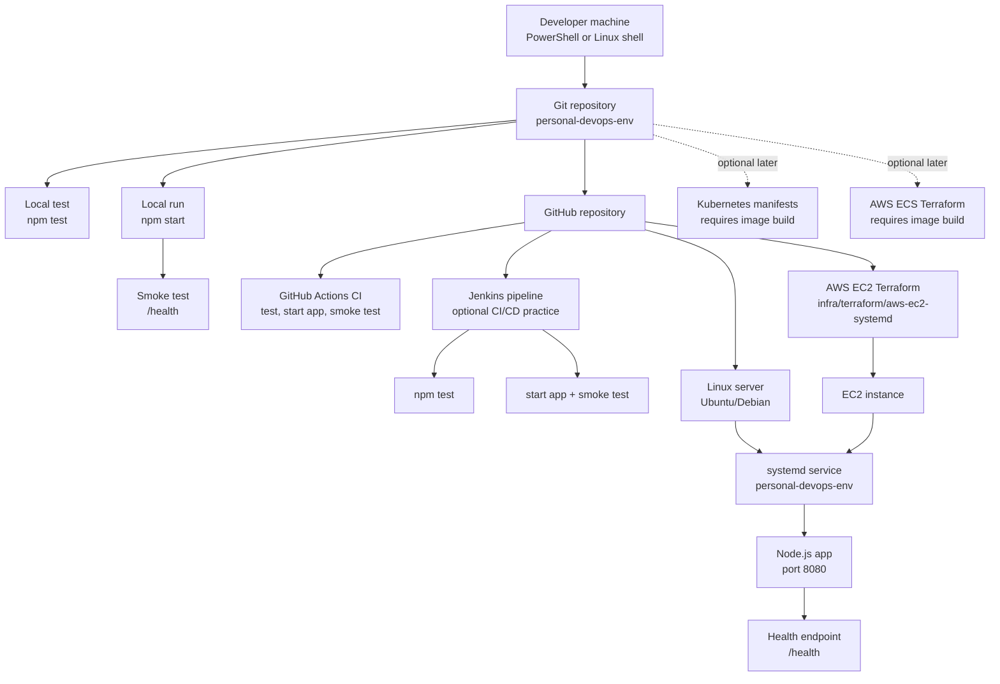

# Architecture And Next Steps

This setup is now designed around a no-Docker personal DevOps workflow. Docker,
Kubernetes, and ECS files remain available as optional future material, but the
recommended real environment path is Node.js, GitHub Actions, Jenkins, Linux
`systemd`, and AWS EC2.

## Current Architecture



## Recommended Real-Environment Order

1. Finish local no-Docker workflow.
2. Push the project to GitHub.
3. Let GitHub Actions run on every push.
4. Set up Jenkins only if you want hands-on CI/CD practice.
5. Deploy to a Linux VM using `systemd`.
6. Move that Linux VM to AWS EC2 using Terraform.
7. Add monitoring and alerts.
8. Add Kubernetes or ECS later only when you want container-based deployment.

## Phase 1: Local Machine

Goal: make sure the app runs on your computer without Docker.

Run:

```powershell
cd C:\Users\khawa\Documents\Codex\2026-07-01\ca-2\outputs\personal-devops-env
Copy-Item .env.example .env
npm.cmd test
npm.cmd start
```

In another terminal:

```powershell
powershell.exe -ExecutionPolicy Bypass -File .\scripts\smoke-test.ps1 -BaseUrl http://localhost:8080
```

Done when:

- `npm.cmd test` passes
- `http://localhost:8080/health` returns `status: ok`
- smoke test passes

## Phase 2: GitHub

Goal: create a real source-control and CI workflow.

Run:

```powershell
git init
git add .
git commit -m "Create personal DevOps environment"
git branch -M main
git remote add origin YOUR_GITHUB_REPO_URL
git push -u origin main
```

Done when:

- repo exists in GitHub
- GitHub Actions runs
- CI passes on push

## Phase 3: Jenkins

Goal: practice Jenkins pipelines without Docker.

Use the included `Jenkinsfile`.

Pipeline stages:

- checkout
- test
- start app
- smoke test
- stop app

Done when:

- Jenkins can pull your repo
- Jenkins pipeline completes successfully
- `app.log` is archived after each run

## Phase 4: Linux Server

Goal: run the app like a real service.

On Ubuntu/Debian:

```bash
chmod +x linux/*.sh scripts/*.sh
./linux/install-tools.sh
./linux/deploy-systemd.sh
```

Useful commands:

```bash
sudo systemctl status personal-devops-env
sudo journalctl -u personal-devops-env -f
curl http://localhost:8080/health
```

Done when:

- service starts after reboot
- logs are visible with `journalctl`
- `/health` works from the server

## Phase 5: AWS Without Docker

Goal: create a realistic cloud environment while still avoiding Docker.

Use:

```text
infra/terraform/aws-ec2-systemd
```

Steps:

```powershell
cd infra/terraform/aws-ec2-systemd
Copy-Item terraform.tfvars.example terraform.tfvars
terraform init
terraform plan
terraform apply
```

Before applying, fill in:

- `vpc_id`
- `subnet_id`
- `key_name`
- `allowed_ssh_cidr`

Done when:

- Terraform creates EC2 successfully
- output `app_url` returns the app
- output `ssh_command` lets you connect to the server

## Phase 6: Production Hardening

Add these before treating it like a serious real environment:

- Use a domain name
- Put Nginx in front of Node.js
- Add HTTPS with Let's Encrypt
- Restrict SSH to your IP only
- Add CloudWatch or another log collector
- Add uptime monitoring
- Add backup strategy for any future database
- Add branch protection in GitHub
- Store secrets outside Git

## What To Do Next

The best next action is to push this project to GitHub and get CI passing. After
that, create the AWS EC2 `terraform.tfvars` file and deploy the no-Docker EC2
environment.
